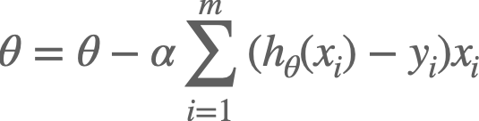

# Project 4

Posted: November 19, 2021

Due: December 07, 2021

## Classification

### Gradient Descent

<strong>Problem 1</strong> <em>Implement the gradient descent algorithm (either batch or stochastic versions) for multiple linear regression. i.e., extend the version of the algorithm in the lecture notes to multiple parameters.</em>

The gradient descent update equation for logistic regression is given by:

<!--

\[
\beta^{k+1} = \beta^k + \alpha \sum_{i=1}^{n} (y_i - p_i(\beta^k))\mathbf{x_i}
\]
-->

where (from the definition of log-odds):

<!--

\[
p_i(\beta^k) = \frac{e^{f_i(\beta^k)}}{1+e^{f_i(\beta^k)}}
\]

-->

and
<!--
\(f_i(\beta^k) = \beta_0^k + \beta_1^k x_{i1} + \beta_2^k x_{i2} + \cdots + \beta_p^k x_{ip}\).

-->

<strong>Problem 2</strong> <em>Derive the above update equation</em>. Write the derivation in a markdown ipynb cell. 

<strong>Problem 3</strong> <em>Implement the gradient descent algorithm (either batch or stochastic versions) for multiple logistic regression.</em> i.e., modify your code in problem 1 for the logistic regression update equation.

Make sure you include in your submission writeup, which version of the algorithm you are solving (stochastic or batch), and make sure to comment your code to help us understand your implementation.

<strong>Problem 4</strong> To test your programs, simulate data from the linear regression and logistic regression models and check that your implementations recover the simulation parameters properly.

Use the following functions to simulate data for your testing:

<pre class="r"><code>
&#35;simulate data for linear regression

gen_data_x, gen_data_y = sklearn.datasets.make_regression(n_samples=100, n_features=20, noise = 1.5)

&#35;simulate data for logistic regression.  This is similar to linear, only now values are either 0 or 1.  
log_gen_data_x, dump_y = sklearn.datasets.make_regression(n_samples=100, n_features=20, noise = 1.5)
log_gen_data_y = [0 if i>0 else 1 for i in dump_y]}</code></pre>

You can use this function as follows in your submission:

<pre class="r"><code>
&#35;a really bad estimator
&#35;returns random vector as estimated parameters
dummy = np.ndarray([100, 20])
for index, row in enumerate(dummy):
    dummy[index] = np.random.normal(0, .1, 20)
plt.plot(gen_data_x, dummy)</code></pre>

Include a similar plot in your writeup and comment on how your gradient descent implementation is working.

<h3>Try it out!</h3>

<ol style="list-style-type: lower-alpha">
<li>
Find a small dataset on which to try out different classification (or regression) algorithms. 
</li>
<li>
Choose <strong>two</strong> of the following algorithms:
</li>
</ol>
<ol style="list-style-type: decimal">
<li>classification (or regression) trees,</li>
<li>random forests 
</li>
<li>linear SVM,</li>
<li>non-linear SVM</li>
<li>k-NN classification (or regression)</li>
</ol>

and compare their prediction performance on your chosen dataset to your logistic regression gradient descent implementation using 10-fold cross-validation. Note: for those algorithms that have hyper-parameters, i.e., all of the above except for LDA, you need to specify in your writeup which model selection procedure you used.

## Submission

Prepare a Jupyter notebook that includes answers for each Problem:

<ol style="list-style-type: decimal">
<li>
For Problems 1 and 3 include your code in the writeup. Make sure they are commented and that the code is readable in your final writeup (e.g., check line widths).
</li>
<li>
For Problem 2, include the derivation of the gradient descent update in the writeup
</li>
<li>
For Problem 4, make sure you run the provided code and include the output in the writeup.
</li>
<li>
For the next section organize your writeup as follows:
</li>
</ol>
<ol style="list-style-type: lower-alpha">
<li>
Describe the dataset you are using, including: what is the outcome you are predicting and what are the predictors you will be using.
</li>
<li>
Include code to obtain and prepare your data as a dataframe to use with your three classification algorithms. In case your dataset includes non-numeric predictors, include the code you are using to transform these predictors into numeric predictors you can use with your logistic regression implementation.
</li>
<li>
Specify the two additional algorithms you have chosen in part (b), and for algorithms that have hyper-parameters specify the method you are using for model selection.
</li>
<li>
Include all code required to perform the 10-fold cross-validation procedure on your three algorithms.
</li>
<li>
Writeup the result of your 10-fold cross-validation procedure. Make sure to report the 10-fold CV estimate of each of the algorithms.
</li>
</ol>

Submit to ELMS at Project 4 Assignment Submission and a .pdf to Gradescope.

## Group work

You are encouraged to work in small groups, but you must prepare your own writeup and submit it. Include the names of the peers who you worked with in the writeup.
